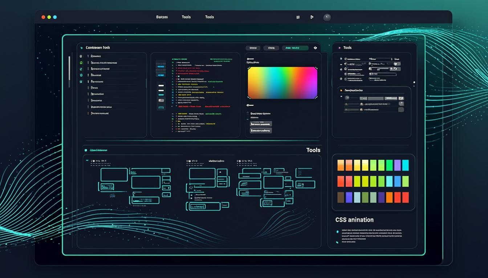

<div align="center">



# Code Aesthetic Showcase

**A fully interactive, 21-section developer tools & CSS playground built with Next.js 16**

[](https://nextjs.org/)
[](https://www.typescriptlang.org/)
[](https://tailwindcss.com/)
[](https://www.framer.com/motion/)
[](https://ui.shadcn.com/)

</div>

---

## Overview

Code Aesthetic Showcase is a production-ready single-page application that demonstrates creative coding, interactive CSS tools, and cutting-edge web development techniques. It features 21 fully interactive sections ranging from a retro terminal emulator to real-time gradient generators, JSON formatters, and CSS animation playgrounds.

## Sections

| # | Section | Description |
|---|---------|-------------|
| 01 | **Terminal** | Interactive terminal with 15+ commands, boot sequence, theme switching (green/amber/white), CRT scanlines, command history |
| 02 | **DevEx** | VS Code-inspired code editors with 3 feature cards, live code preview (React/Python/CSS tabs), count-up metrics |
| 03 | **Brutalism** | Anti-design showcase with broken grid, marquee banners, 404 box, raw HTML source display, chaos button |
| 04 | **Glitch** | Cyberpunk glitch effects with RGB split, Matrix rain canvas, system status dashboard, error log terminal |
| 05 | **Code Art** | 4 style comparisons (Clean/Terminal/Brutalist/Glitch) of the same component, live style switcher, quote rotation |
| 06 | **Playground** | Live HTML/CSS/JS code editor with syntax highlighting, auto-run with debounce, iframe preview, export |
| 07 | **Gradient Lab** | Interactive gradient builder (Linear/Radial/Conic), 2-4 color stops, 8 presets, random generator, CSS/Tailwind/SVG export |
| 08 | **Palette Studio** | 7 color harmony algorithms, WCAG AA/AAA contrast checking, HSL sliders, shades generator, 8 presets, 3 export formats |
| 09 | **Shadow Generator** | Interactive box-shadow designer with multiple layers, inset support, color controls, and CSS output |
| 10 | **Animation** | CSS animation generator with keyframe editor, easing curves, and real-time preview |
| 11 | **CSS Filters** | Visual filter playground with brightness, contrast, blur, hue-rotate, saturate, and more |
| 12 | **SVG Editor** | Inline SVG editor with shape tools, path editing, and live preview |
| 13 | **Typography** | Font showcase with type scale, weight previews, and spacing tools |
| 14 | **Layout (Flexbox/Grid)** | Interactive Flexbox and CSS Grid playground with visual controls |
| 15 | **3D Transforms** | Interactive 3D CSS transform playground with perspective, rotate, and translate controls |
| 16 | **Responsive** | Responsive design showcase with breakpoint previews and device mockups |
| 17 | **Border Generator** | Interactive border-radius and border-style designer with live preview |
| 18 | **CSS Snippets** | 13 curated CSS code snippets with live preview, syntax highlighting, and one-click copy |
| 19 | **Regex Tester** | Real-time regular expression tester with match highlighting, capture groups, and pattern explanation |
| 20 | **JSON Studio** | JSON validator/formatter with syntax highlighting, collapsible tree view, path display, minify, sort keys |
| 21 | **Markdown Lab** | Zero-dependency Markdown parser with split/tab view, toolbar, templates, word count, auto-save, HTML export |
| 22 | **Base64 Encoder** | Encode/decode Base64, URLs, and HTML entities with real-time conversion |

## Features

### Design & UX
- **Dark cyberpunk aesthetic** with emerald/cyan neon accents
- **Full-width responsive layout** optimized for all screen sizes
- **Floating navigation** with active section tracking (desktop pills + mobile hamburger menu)
- **Scroll progress bar** with gradient shimmer effect
- **Particle constellation** hero background (60 desktop / 25 mobile particles)
- **Sticky footer** with animated gradient border
- **Dark/light theme toggle** with localStorage persistence
- **Smooth scroll** between sections
- **Back to top** floating button with animated entrance

### Animations
- Framer Motion throughout (whileInView, AnimatePresence, layoutId)
- Scroll-triggered reveals (fade-in, blur-reveal, divider glow)
- Glitch text effects with RGB split
- Matrix rain canvas animation
- Text character reveal animations (10 stagger delays)
- Typing cursor with gradient glow
- Hover/press micro-interactions on all interactive elements
- `prefers-reduced-motion` accessibility support

### CSS System
- 15+ custom CSS animations (cursor-blink, glitch, matrix-fall, scanline, neon-pulse, etc.)
- Syntax highlighting classes (.syn-keyword, .syn-string, .syn-function, etc.)
- Glassmorphism utilities (.glass-card, .glass-card-hover)
- Glow effects (.glow-emerald, .glow-cyan, .glow-purple)
- Text effects (.text-glow-emerald, .text-reveal-char)
- Custom scrollbar with gradient thumb
- Shimmer and skeleton animations
- 400+ lines of enhanced CSS in globals.css

## Tech Stack

| Category | Technology |
|----------|-----------|
| **Framework** | Next.js 16 (App Router, Turbopack) |
| **Language** | TypeScript 5 |
| **Styling** | Tailwind CSS 4 + globals.css |
| **Components** | shadcn/ui (New York style) |
| **Icons** | Lucide React |
| **Animation** | Framer Motion 12 |
| **State** | React hooks + useSyncExternalStore |
| **Theme** | next-themes |
| **Database** | Prisma ORM (SQLite) |
| **Lint** | ESLint 9 + eslint-config-next |
| **Runtime** | Bun |

## Getting Started

### Prerequisites
- [Bun](https://bun.sh/) (recommended) or Node.js 18+

### Installation

```bash
# Clone the repository
git clone <repo-url>
cd my-project

# Install dependencies
bun install

# Set up database
bun run db:push

# Start development server
bun run dev
```

The app will be available at `http://localhost:3000`.

### Scripts

| Script | Description |
|--------|-------------|
| `bun run dev` | Start development server (port 3000) |
| `bun run lint` | Run ESLint |
| `bun run build` | Production build |
| `bun run start` | Start production server |
| `bun run db:push` | Push Prisma schema to database |
| `bun run db:generate` | Generate Prisma client |
| `bun run db:migrate` | Run database migrations |
| `bun run db:reset` | Reset database |

## Project Structure

```
my-project/
├── public/
│   ├── logo.svg
│   ├── preview.png
│   └── robots.txt
├── prisma/
│   └── schema.prisma
├── src/
│   ├── app/
│   │   ├── globals.css          # 400+ lines of custom CSS
│   │   ├── layout.tsx           # Root layout with ThemeProvider
│   │   ├── page.tsx             # Main page with 21 sections
│   │   └── api/route.ts         # API route
│   ├── components/
│   │   ├── ui/                  # shadcn/ui components
│   │   ├── animation-generator-section.tsx
│   │   ├── base64-tool-section.tsx
│   │   ├── border-generator-section.tsx
│   │   ├── brutalism-section.tsx
│   │   ├── code-comparison-section.tsx
│   │   ├── code-playground-section.tsx
│   │   ├── color-palette-section.tsx
│   │   ├── css-filters-section.tsx
│   │   ├── css-snippets-section.tsx
│   │   ├── devex-section.tsx
│   │   ├── error-boundary.tsx
│   │   ├── flexbox-grid-section.tsx
│   │   ├── glitch-section.tsx
│   │   ├── gradient-generator-section.tsx
│   │   ├── json-formatter-section.tsx
│   │   ├── markdown-preview-section.tsx
│   │   ├── regex-tester-section.tsx
│   │   ├── responsive-showcase-section.tsx
│   │   ├── shadow-generator-section.tsx
│   │   ├── sound-toggle.tsx
│   │   ├── svg-editor-section.tsx
│   │   ├── terminal-section.tsx
│   │   ├── theme-provider.tsx
│   │   ├── theme-toggle.tsx
│   │   ├── transform-3d-section.tsx
│   │   └── typography-section.tsx
│   ├── hooks/
│   │   ├── use-mobile.ts
│   │   └── use-toast.ts
│   └── lib/
│       ├── db.ts               # Prisma database client
│       └── utils.ts            # Utility functions (cn, etc.)
├── Caddyfile                    # Gateway configuration
├── package.json
├── tailwind.config.ts
├── tsconfig.json
└── worklog.md                   # Development handover document
```

## Architecture Decisions

- **Zero external Markdown library** for Markdown Lab — custom parser from scratch to avoid dependency bloat
- **SSR-safe mounting** via `useSyncExternalStore` to prevent hydration mismatches
- **Named exports** for all section components for tree-shaking compatibility
- **Accessibility-first**: ARIA labels, keyboard navigation, focus-visible states, `prefers-reduced-motion`
- **No nested `<button>` elements** — uses `role="button"` + `tabIndex` pattern for interactive wrappers
- **Unique React keys** with component-specific prefixes (no bare `key={i}`)

## License

Private project. All rights reserved.
